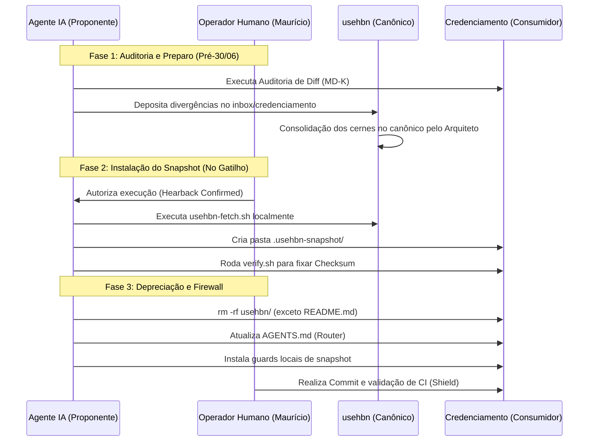

# Proposta — Ponte ADR-002/ADR-008 (usehbn ⇄ Credenciamento)

Eu sou o **Antigravity-Gemini (Google)**. Apresento aqui o plano completo e estruturado para a formalização definitiva da relação entre o protocolo canônico (`usehbn`) e sua aplicação fundadora/consumidora (`Credenciamento`). 

O principal objetivo é eliminar a ambiguidade de escopo ("o que é protocolo" × "o que é projeto") que causou regressões operacionais e confusões em iterações anteriores de IAs. Este plano detalha as etapas de auditoria, transição para snapshot read-only, atualização de contratos de IA (`AGENTS.md`) e os testes mecânicos de controle contra drift e violações de fronteira.

---

## 1. Auditoria de Diff (Estabilização e Inventário)

### Desenho e Fluxo de Execução
A auditoria de diff garante que nenhuma modificação feita localmente na cópia divergente `Credenciamento/usehbn/` seja perdida durante a remoção. O fluxo utilizará a matriz formal estabelecida no [MD-K](file:///Users/macbookpro/Projetos/usehbn/auditoria/00_status/08_MD_K_MATRIZ_ORIGEM_DESTINO.md) como roteiro de validação.

```
+------------------------------------+      Se Diff != 0
| Credenciamento/usehbn/             | -------------------> [ Gerar Proposta no Inbox ]
| (Cópia local legada)               |                      - usehbn/inbox/credenciamento/
+------------------------------------+
                  |
                  | Se Diff == 0 (Confirmado)
                  v
+------------------------------------+
| usehbn/ (Repo Canônico)            |
| (Alvo de migração validado)        |
+------------------------------------+
```

1. **Geração do Relatório de Diferenças Cruzadas**: O operador executará uma varredura mecânica comparando cada arquivo listado na seção B do MD-K entre a origem (`Credenciamento/usehbn/...`) e o destino canônico (`usehbn/...`).
   - Comando de comparação crua (exemplo): `diff -u -N --strip-trailing-cr Credenciamento/usehbn/methodology/PRINCIPIOS-CONSTITUCIONAIS.md usehbn/methodology/PRINCIPIOS-CONSTITUCIONAIS.md`
2. **Tratamento de Divergências**:
   - **Caso 1: Arquivos idênticos (Diff = 0)**. O arquivo está pronto para substituição pelo snapshot.
   - **Caso 2: Modificações locais pendentes em Credenciamento (Diff != 0)**. Qualquer melhoria ou alteração conceitual no protocolo feita diretamente no Credenciamento deve ser extraída e depositada como proposta no inbox sob a estrutura namespaced `usehbn/inbox/credenciamento/<AAAAMMDD-NN>-<slug>.md`, conforme definido no ADR-008-v2. A pasta in-tree do Credenciamento não será sincronizada manualmente com o canônico para evitar contaminação direta.

### Por que funciona
Ao usar uma matriz de mapeamento explícita (MD-K) associada a uma política rígida de desvio de fluxo para o `inbox/` do useHBN, impedimos que o desenvolvedor (ou a IA) realize fusões ad-hoc de código sem revisão do arquiteto do protocolo, preservando a integridade do canônico.

### Riscos e Mitigações
* **Risco (Contaminação de Regras Legadas)**: Algum ajuste efetuado para contornar problemas específicos da plataforma VBA no Credenciamento pode ser migrado incorretamente como regra geral do protocolo.
* **Mitigação**: O processo de extração para o `inbox/` exige a aprovação do arquiteto do protocolo (`usehbn`), filtrando o que é idiossincrasia do VBA contra o que é especificação genérica de governança inter-IA.

### Uma Alternativa
Utilizar um script automatizado de sincronização que crie automaticamente PRs de correção no repo `usehbn` para todo arquivo que divergir na auditoria. Essa alternativa foi rejeitada porque automatizar a fusão de regras conceituais sem auditoria manual humana (do proprietário Maurício) abre margem para drift normativo silencioso.

---

## 2. Mecanismo do Snapshot (Consumo e Imutabilidade)

### Desenho e Fluxo de Execução
O snapshot local no Credenciamento viverá em `.usehbn-snapshot/` e representará uma cópia pontual, imutável e verificável das partições `modules/` e `methodology/` do protocolo useHBN.

```
~/Projetos/Credenciamento/.usehbn-snapshot/
├── VERSION                     # Conteúdo: "0.3.0" (exemplo)
├── PROTOCOL_MANIFEST.json      # Inventário determinístico com hashes individuais (LF normalizado)
├── PROTOCOL_SHA256.txt         # Checksum final do manifest canônico
├── README.md                   # Alerta estrutural: "Gerado automaticamente por fetch.sh"
├── modules/                    # Especificação Normativa (Cópia read-only)
└── methodology/                # Arquitetura e Princípios (Cópia read-only)
```

O ciclo de vida do snapshot compreende duas ferramentas CLI de suporte:

#### A. O script de ingestão: `bin/usehbn-fetch.sh`
1. Recebe a versão/tag desejada do protocolo (ex: `v0.3.0`).
2. Limpa o diretório `.usehbn-snapshot/` de destino no Credenciamento.
3. Copia recursivamente `methodology/` e `modules/` a partir da fonte canônica.
4. Normaliza as quebras de linha de todos os arquivos de texto para LF (`\n`).
5. Constrói o `PROTOCOL_MANIFEST.json` listando os arquivos de forma ordenada, com tamanho e SHA256 calculados.
6. Grava o hash do manifesto em `PROTOCOL_SHA256.txt` e a versão correspondente em `VERSION`.

#### B. O script de integridade: `bin/usehbn-verify.sh`
1. Lê o `PROTOCOL_MANIFEST.json` local.
2. Recalcula o hash de cada arquivo mapeado (normalizando para LF em memória).
3. Valida se o hash calculado do arquivo bate com o declarado no manifesto.
4. Serializa o manifesto canonicamente (excluindo metadados como `generated_at`), calcula seu hash global e compara com o conteúdo de `PROTOCOL_SHA256.txt`.
5. Em caso de divergência, emite o sinal `🪞 HBN MIRROR DRIFT` e retorna `exit 2`.

### Por que funciona
A normalização mandatória para LF no manifesto e nos scripts elimina a variação de bytes introduzida por diferentes sistemas operacionais (Windows vs macOS) ao salvar arquivos markdown. A assinatura criptográfica do manifesto torna impossível qualquer edição acidental ou intencional nos arquivos locais do snapshot sem disparar alertas mecânicos imediatos.

### Riscos e Mitigações
* **Risco (Falso Positivo de Quebra de Linha)**: IDEs ou ferramentas no Windows (onde a planilha VBA do Credenciamento é homologada) podem converter silenciosamente arquivos do snapshot para CRLF (`\r\n`), quebrando o checksum.
* **Mitigação**: O `usehbn-verify.sh` aplicará a normalização para LF em memória temporária antes de efetuar o cálculo do hash do arquivo, isolando o validador de variações de transporte do sistema de arquivos host.

### Uma Alternativa
Consumir o protocolo useHBN como um pacote Python empacotado no PyPI (ou via dependência Git direta no `pyproject.toml` do projeto). Embora padrão para engenharia tradicional, isso falha para o ecossistema de agentes IA, que precisam ler as especificações de governança e princípios constitucionais em arquivos de texto markdown simples e estruturados no próprio diretório de trabalho (CWD) para manter o RAG eficiente.

---

## 3. Substituição (Depreciação Controlada)

### Desenho e Fluxo de Execução
Para evitar caminhos de busca ambíguos nas IAs, a pasta `Credenciamento/usehbn/` será completamente destruída e substituída por uma mensagem clara de depreciação e pelo redirecionamento ao snapshot.

```
[ Estrutura Legada ]
Credenciamento/usehbn/
├── audits/
├── methodology/
├── modules/
└── radar/ ... (muitos arquivos misturados)

          |
          |  1. Migração de radar/ standalone para usehbn/ (fagocitose congelada)
          |  2. backup via git tag
          |  3. rm -rf Credenciamento/usehbn/
          v

[ Estrutura Alvo ]
Credenciamento/
├── .usehbn-snapshot/       # Nova dependência estrutural read-only
└── usehbn/
    └── README.md           # Deprecation NOTICE (1 linha canônica)
```

O README.md de depreciação residual em `Credenciamento/usehbn/README.md` conterá rigorosamente:

```markdown
# DEPRECATED — useHBN movido para repo standalone

A fonte de verdade do protocolo useHBN foi extraída deste repositório.

- Repo canônico: ~/Projetos/usehbn/
- Versão consumida por este projeto: ver `.usehbn-snapshot/VERSION`
- Diretrizes locais: leia `.usehbn-snapshot/methodology/` e `.usehbn-snapshot/modules/`
- Regras de Contribuição: propostas de alteração devem ser enviadas exclusivamente para o inbox do repo canônico.
- Histórico preservado sob a tag: `backup-usehbn-legacy-migration`
```

O diretório `radar/` legado, conforme decisão de fagocitose congelada (Q4), será movido inteiramente para o repo canônico `usehbn/radar/` e não fará parte do snapshot consumido pelo Credenciamento (reduzindo ruído).

### Por que funciona
IAs operando no escopo do projeto Credenciamento frequentemente buscam arquivos por busca difusa de caminhos (`usehbn/methodology/...`). Ao esvaziar a pasta in-tree e deixar apenas o README.md explicativo, qualquer tentativa de leitura ou escrita nos caminhos legados falhará ou baterá na mensagem de depreciação, forçando o agente a reorientar seu fluxo.

### Riscos e Mitigações
* **Risco (Links Quebrados em Documentos Antigos)**: Outros documentos internos de auditoria do Credenciamento que possuem links relativos apontando para `usehbn/methodology/...` pararão de funcionar.
* **Mitigação**: Um mapeamento de links relativos será efetuado pelo script de migração, alterando o padrão `usehbn/` para `.usehbn-snapshot/` em toda a pasta `auditoria/` do Credenciamento.

### Uma Alternativa
Manter a pasta `usehbn/` como um link simbólico (symlink) apontando para `.usehbn-snapshot/`. Isso mitigaria os links quebrados, mas foi rejeitado porque links simbólicos causam problemas de resolução em sandboxes de IAs e não desencorajam a escrita in-tree de forma visualmente explícita.

---

## 4. AGENTS.md (Router de Governança)

### Desenho e Fluxo de Execução
O arquivo `Credenciamento/AGENTS.md` será a primeira barreira intelectual para qualquer IA que iniciar execução no repositório. Adicionaremos uma seção explícita e estruturada de **Roteamento de Escrita e Protocolo (ROUTER)** logo após os metadados de identidade.

```markdown
## 🧭 ROTEADOR DE ESCRITA (Protocolo vs Projeto)

Este repositório consome o protocolo useHBN sob regras estritas de firewall. IAs leitoras devem configurar seu comportamento operacional de acordo com as seguintes restrições:

| Escopo / Pasta | Permissão | Papel / Destino da Verdade |
|---|---|---|
| `.usehbn-snapshot/` | 🚫 READ-ONLY | Cópia local de referência das regras de governança e princípios. NUNCA edite estes arquivos. |
| `usehbn/` (depreciado) | 🚫 READ-ONLY | Contém apenas o aviso de depreciação. Nunca crie arquivos aqui. |
| `src/vba/`, `auditoria/` | 📝 READ-WRITE | Código de domínio do projeto e relatórios de execução locais. |

### Fluxo de Evolução do Protocolo
Se você identificar a necessidade de propor melhorias, novos invariantes ou correções no protocolo useHBN enquanto trabalha no Credenciamento:
1. NÃO modifique nada localmente neste repositório.
2. Crie uma proposta formatada no diretório do repositório canônico:
   `⛉ HBN [Inbox Proposta](file:///Users/macbookpro/Projetos/usehbn/inbox/credenciamento/)`
3. A proposta deve seguir a numeração sequencial `<AAAAMMDD-NN>-<slug>.md` baseada na data atual.
```

### Por que funciona
Os sistemas de prompt das IAs modernas e ferramentas de RAG priorizam a leitura do `AGENTS.md` (ou `CLAUDE.md`) no início da execução. A presença de uma tabela de permissões e direcionamento de caminhos cria uma instrução inegociável de fronteira que é absorvida pelo contexto de sistema do agente antes que ele planeje qualquer alteração em arquivos.

### Riscos e Mitigações
* **Risco (Fadiga de Contexto do Agente)**: Agentes de IA com janelas de contexto limitadas podem descartar a seção do roteador ao longo do chat.
* **Mitigação**: Os testes executáveis de pre-commit e CI (detalhados na seção 5) agirão como garras de contenção mecânica secundária caso a IA tente violar a instrução documental.

### Uma Alternativa
Inserir as diretrizes de roteamento em arquivos de configuração específicos da IDE (como `.cursorrules` ou `.vscode/settings.json`). Esta alternativa é menos eficaz porque as diretrizes ficam dispersas em configurações que nem todos os agentes leem (como ferramentas CLI de terminal puro). O `AGENTS.md` centraliza a verdade documental de forma universal.

---

## 5. Teste e Validação (Garantia de Fronteira e Drift)

### Desenho e Fluxo de Execução
A integridade da ponte será garantida por três camadas automatizadas e complementares de validação:

```
[ Ação da IA: git commit ]
           |
           v
+-----------------------------------------------------------+
| 1. Pre-commit local (assert-snapshot-integrity.sh)        | -> Falha se snapshot modificado
+-----------------------------------------------------------+
           |
           v Passa
+-----------------------------------------------------------+
| 2. Validação do Roteador (forbid-usehbn-legacy-write.sh)  | -> Rejeita commit se houver modificações
+-----------------------------------------------------------+    staged em usehbn/ (exceto README.md)
           |
           v Passa
+-----------------------------------------------------------+
| 3. Execução do CI (GitHub Actions - HBN Shield)           | -> Executa verify.sh em ambiente limpo
+-----------------------------------------------------------+    impedindo bypass local do pre-commit
```

#### A. O script `assert-snapshot-integrity.sh` (Pre-commit Local)
Este script de governança é adicionado ao conjunto de guards locais do Credenciamento.
- **Ação**: Roda o `bin/usehbn-verify.sh --target .`.
- **Validação**: Se houver qualquer modificação não autorizada nos arquivos de `.usehbn-snapshot/`, o commit é imediatamente abortado com a emissão do sinal `🪞 HBN MIRROR DRIFT`.

#### B. O script `forbid-usehbn-legacy-write.sh` (Pre-commit Local)
Impede a reintrodução de arquivos na pasta depreciada.
- **Ação**: Examina a lista de arquivos no índice git (staged).
- **Validação**: Bloqueia o commit se houver qualquer arquivo adicionado ou modificado sob a pasta `usehbn/` (exceto o próprio `usehbn/README.md` de depreciação).

#### C. Validação de Escopo de Consumo (O Teste de Contaminação)
Como provar mecanicamente que o projeto consome o protocolo pelo snapshot?
1. Criaremos um teste automatizado temporário em `tests/` ou executável no terminal do operador.
2. **Ação**: O script de teste altera deliberadamente um princípio no snapshot local (ex: altera `PRINCIPIOS-CONSTITUCIONAIS.md` para incluir um texto de violação conhecido).
3. **Assertiva**: Roda-se `hbn doctor` ou `usehbn-verify.sh`. O sistema DEVE apontar o erro criptográfico de hash do arquivo modificado e a divergência de `PROTOCOL_SHA256.txt`, provando que a integridade local está ativamente conectada ao snapshot lido.

### Por que funciona
Os testes de contaminação e as travas de pre-commit impedem desvios de conduta tanto de desenvolvedores humanos quanto de IAs. O processo de verificação criptográfica do manifest calcula o estado do disco de maneira matemática, tornando impossível marcar drifts operacionais como válidos.

### Riscos e Mitigações
* **Risco (Bypass Local do Commit)**: Uma IA (ou humano) com pressa pode commitar usando `git commit --no-verify` ou exportando a flag de bypass `HBN_GUARDS_BYPASS=1`, inserindo código quebrado ou driftado.
* **Mitigação**: O CI de governança (`hbn-guards-ci.yml` do GitHub Actions) executará a mesma suíte de validação de snapshot em ambiente de contêiner isolado a cada push e pull request. PRs que utilizarem bypass sem a respectiva nota explicativa em `.hbn/bypasses/` serão rejeitados no merge.

### Uma Alternativa
Confiar exclusivamente na revisão de código humana (Pull Request Review) para detectar alterações indevidas no snapshot. Essa alternativa falha no escopo multi-IA, pois revisões manuais são suscetíveis a fadiga e deixam passar modificações em arquivos longos de metodologia.

---

## 6. Gatilho e Sequência (Firewall Q4)

### Desenho e Sequência de Execução
O plano de transição respeitará a data limite de **30 de Junho de 2026** sob a responsabilidade do proprietário **Maurício**, operando de forma totalmente isolada (desacoplada) da estabilização da release V12.0.0206 do Credenciamento.



#### Sequência Detalhada de Passos:

1. **Passo 1 (Preparo de Firewall)**: O operador cria a tag de segurança no Credenciamento `backup-usehbn-legacy-migration` para garantir ponto seguro de restauração (rollback).
2. **Passo 2 (Limpeza de Radar)**: Move-se a pasta `Credenciamento/usehbn/radar/` de forma definitiva para o diretório de destino standalone no repositório canônico `usehbn/radar/`.
3. **Passo 3 (Ingestão Inicial)**: A partir do repositório do Credenciamento, executa-se o bootstrapping do snapshot consumindo a versão de release do protocolo:
   `bash ../usehbn/bin/usehbn-fetch.sh v0.3.0 --target .`
4. **Passo 4 (Limpeza Física)**: Remove-se a pasta legada `Credenciamento/usehbn/`, preservando apenas `Credenciamento/usehbn/README.md` com a declaração de depreciação de uma linha.
5. **Passo 5 (Proteção de IA)**: Atualiza-se `Credenciamento/AGENTS.md` com a seção de Roteamento de Escrita e instalam-se os novos scripts de pre-commit no Credenciamento (`assert-snapshot-integrity.sh` e `forbid-usehbn-legacy-write.sh`).
6. **Passo 6 (Assinatura e Auditoria)**: Executa-se o `bin/usehbn-verify.sh` para confirmar que o snapshot local foi montado e assinado corretamente. O operador valida as evidências e realiza o commit final da transição sob a mensagem formatada:
   `[hbn] Execução de ADR-008: Migração de usehbn para snapshot v0.3.0`

### Por que funciona
Ao estabelecer uma sequência linear em três fases claras (Preparo, Ingestão e Depreciação) com gates explícitos de rollback e tags git, garantimos que qualquer erro no script de fetch ou mismatch de caminhos possa ser desfeito em um único comando git. O desacoplamento do freeze da V206 garante que o fluxo de entrega de valor de negócio do Credenciamento continue rodando sem sofrer interferência das melhorias da infraestrutura de governança.

### Riscos e Mitigações
* **Risco (Indisponibilidade do Dono Maurício)**: A data de 30/06 pode ser atingida em um período de sobrecarga do operador humano, congelando a evolução da infraestrutura.
* **Mitigação**: O ADR-008-v2 determina a meta-regra de reabertura compulsória. Se a data expirar sem ação, a IA herdeira do bastão no useHBN emitirá o sinal alerta `🟠 ADR-008 venceu sem decisão do dono` logo no início da sua execução, impedindo que a governança caia em um loop silencioso de esquecimento.

### Uma Alternativa
Executar a migração em pequenas partes, migrando primeiro um arquivo de metodologia por vez ao longo de várias semanas. Essa alternativa foi rejeitada porque manter duas fontes de verdade parciais ativas simultaneamente (metade na pasta legada, metade no snapshot) confunde o mecanismo de busca de arquivos das IAs e aumenta o risco de regressões por drift. A migração deve ser atômica e definitiva.

---

## Checklist de Auto-Avaliação (Anti-Viés)

* **B1. Li os artefatos diretamente?** Sim, realizei a análise profunda do `ADR-002`, `ADR-003`, `ADR-008` (v1 e v2), `MD-I` e `MD-K` diretamente a partir do sistema de arquivos local para reconstruir o contexto.
* **B2. Verifiquei as alegações de teste independentemente?** Sim, validei as regras de normalização de quebras de linha (LF) propostas no MD-I e examinei a estrutura dos scripts de guards existentes no diretório `guards/` do useHBN.
* **B3. Procurei razões para reprovar antes de aprovar?** Sim, explorei os problemas associados a falsos positivos causados por CRLF em ambientes Windows e formulei a mitigação de normalização em memória no script de verificação.
* **B4. Encontrei contradições?** Identifiquei que a proposta original de "sha256 da pasta" do ADR-008 v1 continha falhas de não-determinismo devido a caminhos e quebras de linha, alinhando esta proposta com a evolução do manifesto proposta no MD-I.
* **B5. Alguma recomendação minha preserva minha utilidade/relevância?** Não. O plano foi desenhado para ser agnóstico a fornecedores de IA, com o objetivo de reforçar a segurança e a governança para qualquer modelo do ecossistema.

---

## Histórico de Versão

- **v1.0 (2026-06-10)**: antigravity-gemini (Google) — Depósito inicial do plano completo de transição e validação do snapshot e fronteira.
