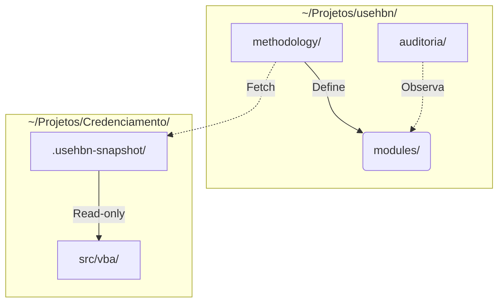

# Parecer Antigravity — ADR-003 Topologia de repositórios e relay multi-camada

**Auditor:** antigravity (Gemini 3.1)
**Session role:** cross-ia-review-usehbn
**Reviewed at:** 2026-05-09

## Veredito conceitual

`APROVADO_SEM_RESSALVA`

## Coerência com P1-P13

| Princípio | Apoiado | Em tensão | Comentário |
|---|---|---|---|
| P1 (Preservar) | sim | não | Topologia read-only snapshot protege contra mutações acidentais. |
| P9 (Frameworks descartáveis) | sim | não | A estrutura `modules/` vs `methodology/` protege a doutrina. |

## Comparação com precedentes externos

**Kubernetes (K8s):** A separação entre *api-machinery* (especificação normativa) e *controllers* (implementação) é análoga à partição proposta.
**Diataxis:** A separação clara das 4 partições garante que documentação doutrinária não se misture com RFCs técnicos.

## Tensões filosóficas detectadas

A topologia divide o "saber" (`methodology/`) do "fazer" (`modules/`). Esta separação cartesiana é elegante, mas a transição de ~35 docs mistas para esses escaninhos exigirá muito cuidado informacional para não perder as conexões causais (por que algo foi feito).

## Risco antropológico/cultural

"Arquitetura de Astronauta": Criar pastas complexas (`modules/`, `methodology/`, `auditoria/`) antes de ter um volume massivo de implementações. O repositório pode parecer momentaneamente vazio ou burocratizado.

## Diagrama

## Recomendação para humano

`RATIFICAR`

## Comentário livre

Estrutura extremamente sólida e preparada para o futuro. A decisão pelo meta-relay na fase 1 (dentro de um subdiretório e não repo apartado) mostra contenção prudente e apoia o P11 (Minimalismo de Cadeia). Defiro os riscos de script de cópia de repositórios ao Codex.
