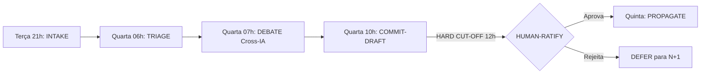

# Parecer Antigravity — ADR-001 Quarta de Sanitização

**Auditor:** antigravity (Gemini 3.1)
**Session role:** cross-ia-review-usehbn
**Reviewed at:** 2026-05-09

## Veredito conceitual

`APROVADO_COM_RESSALVA`

## Coerência com P1-P13

| Princípio | Apoiado | Em tensão | Comentário |
|---|---|---|---|
| P11 (Minimalismo) | sim | não | Dúvida ou estouro de janela = DEFER/DELETE. |
| P5 (Humano no controle)| sim | não | A IA propõe os drafts; só o humano faz o RATIFY real. |

## Comparação com precedentes externos

**Sprints / Tuesday Triage (CNCF) / RFC Weeks:** Rituais de higienização de backlog funcionam pela previsibilidade. O fato de usar o limitador financeiro ("Janela Anthropic") como trigger de *cut-off* para evitar loops infinitos de IAs é uma mecânica brilhante (FinOps como Restrição Arquitetural).

## Tensões filosóficas detectadas

A amarração explícita à janela de faturamento de uma empresa específica (Anthropic) cruza a fronteira entre arquitetura de protocolo agnóstico e restrição local de infraestrutura. Isso subverte levemente o P9 (Frameworks são descartáveis), pois liga o ritmo da governança a um contrato de cartão de crédito.

## Risco antropológico/cultural

1. **Performance/Cargo Cult:** Fazer a Quarta apenas "para cumprir tabela".
2. **Abuso da Quarta Manual:** O operador ansioso pode começar a invocar `--manual` toda sexta e segunda-feira, diluindo o peso do ritual principal.
3. A janela rígida (12h BRT) pode forçar a IA a tomar decisões precipitadas (DEFERs sistêmicos) se as filas da API do modelo estiverem lentas na manhã de quarta.

## Diagrama

## Recomendação para humano

`RATIFICAR`

## Comentário livre

Embora haja tensão ao acoplar o ritual à janela de faturamento, a "Cláusula da Janela de Faturamento" prevê explicitamente a mudança se o provedor mudar. Isso é honesto. Como auditor de risco humano, o maior perigo aqui é a Quarta virar um dreno de energia do operador. O limite estrito de <30 min para HUMAN-RATIFY deve ser levado a sério.
