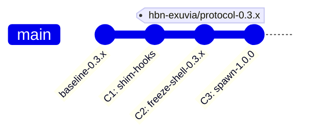

# Parecer de Auditoria de Desenho e Segurança — Implementação Exúvia

Este parecer analisa a segurança operacional e os detalhes de desenho para a transição do useHBN para o modelo **"versão = pasta com o sistema inteiro"**, conforme as diretrizes do gate humano e o plano de transição v2.

---

## 1. Sequência Segura de Commits para o Bootstrap da 1ª Muda
A transição da estrutura atual (raiz do repositório) para a estrutura versionada (`versao_0_3_x/` congelada e `versao_1_0_0/` ativa) exige uma coreografia precisa para evitar a desativação temporária dos hooks de commit (**violação de P10**) ou perda de rastreabilidade do histórico (**violação de P1**).

### Sequência Proposta de Commits



#### Commit C1: Preparação do Terreno (Shim de Roteamento)
*   **Objetivo**: Tornar os ganchos do Git (`.git/hooks/`) e a biblioteca de guards capazes de ler a versão ativa dinamicamente antes que qualquer arquivo seja movido.
*   **Ações**:
    1.  Criar o arquivo de controle `.hbn/active-version` na raiz do repositório contendo apenas `.`.
    2.  Atualizar o hook unversionado `.git/hooks/pre-commit` (ver [.git/hooks/pre-commit:3](file:///Users/macbookpro/Projetos/usehbn/.git/hooks/pre-commit#L3)) para ler `.hbn/active-version` e executar o runner da subpasta correspondente, caso exista.
    3.  Modificar a biblioteca de caminhos comuns (ver [guards/lib/common.sh:43-57](file:///Users/macbookpro/Projetos/usehbn/guards/lib/common.sh#L43-L57)) para reconhecer se está operando dentro de uma subpasta de versão ou na raiz do repositório.
*   **Status de Enforcement**: 100% ativo (aponta para a raiz `.` e roda os guards legados normalmente).

#### Commit C2: Congelamento da Casca (`versao_0_3_x/`)
*   **Objetivo**: Consolidar a exúvia antiga no caminho `versao_0_3_x/` sem perder o histórico do Git (P1) e assegurar que essa versão seja arquivada em estado imutável.
*   **Ações**:
    1.  Executar `git mv` de todos os arquivos controlados do sistema (excluindo os ganchos globais e o arquivo `.hbn/active-version`) para dentro de `versao_0_3_x/`. O uso de `git mv` garante a preservação dos metadados e o rastreamento do histórico de renames pelo Git.
    2.  Fazer `git add -f` dos arquivos historicamente `untracked` que devem ser preservados (como handoffs e pareceres prévios).
    3.  Atualizar `.hbn/active-version` para apontar para `versao_0_3_x`.
    4.  Criar a nota de bypass de transição regulamentar em `.hbn/bypasses/<timestamp>-antigravity-bootstrap-exuvia.md` para justificar a movimentação em massa que causará falsos-positivos temporários em G-REG (ver [guards/assert-registry-line.sh:121-134](file:///Users/macbookpro/Projetos/usehbn/guards/assert-registry-line.sh#L121-L134)).
    5.  Efetuar o commit sob a flag de bypass supervisionada (`HBN_GUARDS_BYPASS=1`).
*   **Checkpoint**: Imediatamente após o commit, fixar a tag imutável `hbn-exuvia/protocol-0.3.x` (ver [.hbn/proposals/20260614-030748-codex-exuvia-plano-v2.md:158](file:///Users/macbookpro/Projetos/usehbn/.hbn/proposals/20260614-030748-codex-exuvia-plano-v2.md#L158)). A partir deste ponto, a casca está perfeitamente selada e imutável.

#### Commit C3: Nascimento da Nova Versão (`versao_1_0_0/`)
*   **Objetivo**: Instanciar a nova estrutura limpa e simplificada sem travar os ganchos locais.
*   **Ações**:
    1.  Copiar/criar os arquivos da nova versão sob `versao_1_0_0/`.
    2.  Escrever o manifesto `versao_1_0_0/.hbn/ledger/MANIFEST-1.0.0.md` e o documento de transição `/hbn-exuvia/bridge/0.3.x-to-1.0.0.md`.
    3.  Atualizar o arquivo `.hbn/active-version` na raiz para conter `versao_1_0_0`.
    4.  Executar o commit. O hook de pre-commit lerá automaticamente `versao_1_0_0` e executará a nova suíte de guards em `versao_1_0_0/guards/`.

---

## 2. Hooks e Caminho-Raiz
Para evitar o risco de hooks órfãos ou desatualizados, o gancho `.git/hooks/pre-commit` e o script `assert-canonical-root.sh` devem tratar a raiz da versão como uma entidade dinâmica.

### Resolução Dinâmica no Hook pre-commit
Recomenda-se a substituição do hook fixo por um shim que leia o arquivo de configuração de versão:
```bash
#!/usr/bin/env bash
TOP="$(git rev-parse --show-toplevel)"
ACTIVE_VERSION="$(cat "$TOP/.hbn/active-version" 2>/dev/null || echo ".")"

if [[ "$ACTIVE_VERSION" != "." && -f "$TOP/$ACTIVE_VERSION/guards/hbn-guards-runner.sh" ]]; then
    exec bash "$TOP/$ACTIVE_VERSION/guards/hbn-guards-runner.sh"
else
    exec bash "$TOP/guards/hbn-guards-runner.sh"
fi
```
*   **Vantagem**: Repontar a execução na próxima exúvia (ex.: para `versao_2_0_0/`) torna-se tão simples quanto commitar a alteração no texto de `.hbn/active-version`. Nenhuma cirurgia local em arquivos `.git/hooks/` unversionados é necessária.

### Ajuste em `guards/lib/common.sh`
O `guard_canonical_root` deve ser adaptado para calcular dinamicamente a subpasta da versão ativa (ver [guards/lib/common.sh:43-57](file:///Users/macbookpro/Projetos/usehbn/guards/lib/common.sh#L43-L57)):
```bash
guard_canonical_root() {
    local repo_root
    repo_root="$(git rev-parse --show-toplevel 2>/dev/null || echo "")"
    [[ -z "$repo_root" ]] && return 1
    repo_root="$(cd "$repo_root" && pwd -P)"

    local canonical_file="${repo_root}/.hbn/canonical-root"
    [[ ! -f "$canonical_file" ]] && return 1
    local repo_canonical
    repo_canonical="$(grep -v '^\s*#' "$canonical_file" | grep -v '^\s*$' | head -1)"
    repo_canonical="$(cd "$repo_canonical" && pwd -P)"

    # Determinar a pasta de versão corrente a partir da localização do guard executado
    local lib_dir
    lib_dir="$(cd "$(dirname "${BASH_SOURCE[0]}")" && pwd -P)"
    local version_root
    version_root="$(cd "${lib_dir}/../.." && pwd -P)"

    if [[ "$version_root" == "$repo_root" ]]; then
        echo "$repo_canonical"
    else
        local rel_path="${version_root#$repo_root/}"
        echo "${repo_canonical}/${rel_path}"
    fi
}
```

---

## 3. Guards Relativos à Versão
Atualmente, os guards assumem caminhos absolutos baseados no topo do repositório, o que gera o risco de bypass ou falso-positivos ao avaliar arquivos sob pastas de versões.

### Normalização do Diff
Em `assert-registry-line.sh` (ver [guards/assert-registry-line.sh:124-134](file:///Users/macbookpro/Projetos/usehbn/guards/assert-registry-line.sh#L124-L134)) e `assert-self-path.sh`, a lista de arquivos modificados retornada pelo Git (`git diff`) trará o prefixo da pasta da versão (ex.: `versao_1_0_0/core/relay-spec.md`).

Para mitigar isso:
1.  **Prefix Stripping**: Os guards devem normalizar os caminhos staged removendo o prefixo da pasta ativa antes da correspondência de padrões (`is_numbered_artifact`):
    ```bash
    guard_strip_version_prefix() {
        local f="$1"
        local active_dir
        active_dir="$(cat "$(git rev-parse --show-toplevel)/.hbn/active-version" 2>/dev/null || echo ".")"
        if [[ "$active_dir" != "." && "$f" == "$active_dir"/* ]]; then
            echo "${f#$active_dir/}"
        else
            echo "$f"
        fi
    }
    ```
2.  **Mapeamento Local do REGISTRY.md**: Ao manter os caminhos dentro do `REGISTRY.md` de cada versão como caminhos relativos ao próprio diretório da versão (ex.: `core/relay-spec.md` em vez de `versao_1_0_0/core/relay-spec.md`), garantimos a portabilidade do ledger. O guard G-REG cruza o caminho normalizado obtido no passo anterior com as colunas do `REGISTRY.md` local da versão.

---

## 4. Reversibilidade (P6)
O rollback de uma muda que altera toda a estrutura do repositório deve ser robusto e testável.

### Estratégia de Rollback
Como o histórico completo e a casca anterior permanecem intactos sob a tag `hbn-exuvia/protocol-0.3.x`:
1.  **Aborto de Emergência (pré-push)**: `git reset --hard hbn-exuvia/protocol-0.3.x` reconstrói instantaneamente a área de trabalho para o baseline funcional anterior.
2.  **Reversão pós-push (histórico público)**:
    Se os commits já foram integrados na main, o rollback é efetuado revertendo os commits que criaram a nova pasta e alteraram a versão ativa.
    ```bash
    git revert <commit-C3-sha> <commit-C2-sha>
    ```
    Isso exclui a pasta `versao_1_0_0/` e restabelece a execução a partir do diretório `versao_0_3_x/` (já que o arquivo `.hbn/active-version` voltará a apontar para `versao_0_3_x`).
3.  **Segurança do Token**: O estado do bastão (`.git/` global) não é afetado pelo checkout/revert, o que previne a perda do token de orquestração durante os passos de emergência.

---

## 5. Glacier + Leitura
A redução do contexto de entrada para as IAs e a governança de versões frias são pontos fundamentais.

### Leitura Auto-contida
*   **Filtro do Contexto**: A IA deve receber em seu prompt de sistema ou arquivo de entrada (`CLAUDE.md`, `.gemini/config`) a instrução explícita de focar apenas no diretório indicado em `.hbn/active-version`.
*   **rgignore / gitignore**: O arquivo `.rgignore` na raiz do repositório deve ignorar todas as pastas `versao_*` que não correspondam à versão corrente. Isso impede que ferramentas de busca global (ripgrep) tragam duplicatas que possam confundir os modelos de linguagem.

### Arquivamento Glacier
Quando uma versão antiga (ex.: `versao_0_3_x/`) for arquivada (removida do clone local ativo para um repositório secundário ou branch arquival fria):
*   **Prevenção de Quebra de Link**: O documento de transição (`EXUVIAS.md` ou manifestos de pontes) não deve conter links relativos diretos (`../versao_0_3_x/...`), pois eles quebrarão quando a pasta for excluída.
*   **Solução**: Os links para arquivos históricos na ponte devem apontar para a referência canônica permanente no Git (ex.: link completo apontando para o commit da tag `hbn-exuvia/protocol-0.3.x` no servidor remoto).

---

## 6. Riscos Não Previstos
Esta auditoria identificou os seguintes riscos arquiteturais não cobertos na proposta original:

1.  **Bloat de Histórico do Git (Duplicação Física)**:
    *   *Risco*: Copiar o sistema inteiro para novas subpastas a cada versão gerará duplicação física no Git. Embora o Git faça compressão por delta de forma eficiente, a longo prazo a árvore do repositório pode acumular arquivos duplicados.
    *   *Mitigação*: Garantir que renames sejam amplamente usados e que a limpeza e envio de pastas antigas para o Glacier ocorra em intervalos bem definidos (cadência de releases).
2.  **Conflitos de Mesclagem Multiversão**:
    *   *Risco*: Se dois desenvolvedores trabalhar em ramificações diferentes com versões ativas distintas, a mesclagem de `.hbn/active-version` gerará conflito e poderá expor o repositório a uma versão inconsistente.
    *   *Mitigação*: G-CR deve validar rigorosamente se o conteúdo de `.hbn/active-version` corresponde a uma pasta de versão válida e stageada no mesmo commit.
3.  **Desalinhamento Local de Hooks (Hooks Órfãos)**:
    *   *Risco*: Como os hooks dentro de `.git/hooks/` não são compartilhados via push/pull do repositório, novos clones ou colaboradores que não executarem o script de setup rodarão commits sem nenhum enforcement.
    *   *Mitigação*: Implementar um pre-flight na ferramenta de orquestração (runtime) que recuse a execução de qualquer tarefa se os ganchos locais do repositório não estiverem sincronizados com o modelo dinâmico.

---

## 7. Recomendações e Veredito

**VEREDITO: APROVADO (VETO_ADOCAO: NÃO)**

A implementação do modelo de versão auto-contida é robusta e viável desde que a transição utilize a sequência controlada de commits e a resolução dinâmica de raiz canônica aqui descrita.

---
*Fim do Parecer.*
