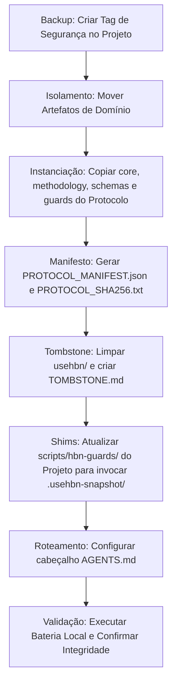

SOU: antigravity · familia Google · papel consultor

# PARECER DE DESENHO DE PROTOCOLO: A PONTE PROTOCOLO×PROJETO
- **Autor**: antigravity (Família Google)
- **Papel**: Consultor de Desenho de Protocolo
- **Data/Hora**: 2026-06-26T21:17:14-04:00
- **Contexto**: Transição do espelho misto `usehbn/` para a membrana `.usehbn-snapshot/` no projeto `Credenciamento` sob as guardas do protocolo `usehbn` em `v1-estavel` (commit `a67e8049ed6fd4f81423ee60194a2f5896f25af0`).

---

## 1. CRÍTICA DAS 3 GARANTIAS: IMPEDIMENTO DE CONFUSÃO PROTOCOLO×PROJETO

O desenho proposto de **"duas camadas, uma membrana"** estabelece uma separação física e conceitual correta, mas apresenta pontos cegos onde uma IA fria/naive (sem histórico ou contexto) pode se confundir no disco.

### Riscos Concretos de Confusão Identificados no Disco:

1. **A Homonímia das Pastas `.hbn/` (Semânticas Conflitantes)**
   - No **Protocolo** (`usehbn`), a pasta `.hbn/` contém o estado, modelos e mensagens do desenvolvimento do *próprio protocolo* (ex.: `.hbn/results/`, `.hbn/models/`).
   - No **Projeto** (`Credenciamento`), a pasta `.hbn/` armazena os logs operacionais, readbacks e hearbacks da governança das *mudanças de domínio* (VBA/Excel) (ex.: `.hbn/readbacks/`, `.hbn/hearbacks/`).
   - *Ponto de Confusão*: Uma IA buscando entender o "estado do HBN" ou "regras de validação do HBN" pode ler os arquivos `.hbn/` de domínio no projeto achando que está alterando ou consultando as definições do protocolo, e vice-versa.
   
2. **Duplicação e Triplicação de Arquivos em Busca Global (IDE/Workspace)**
   - Como o workspace ativo do desenvolvedor engloba o diretório pai `/Users/macbookpro/Projetos`, ferramentas de busca recursiva (`grep`, ripgrep ou indexação de vetores de RAG da IDE) encontrarão os mesmos arquivos metodológicos e de guards em até três caminhos diferentes:
     - `~/Projetos/usehbn/methodology/` (repositório canônico do protocolo)
     - `~/Projetos/Credenciamento/usehbn/methodology/` (o espelho antigo)
     - `~/Projetos/Credenciamento/.usehbn-snapshot/methodology/` (o novo snapshot)
   - *Ponto de Confusão*: Sem um isolamento rígido de escopo na chamada da ferramenta, a IA pode ler arquivos da pasta errada (por exemplo, ler regras obsoletas do espelho antigo ou tentar escrever alterações diretamente no repositório canônico `usehbn` enquanto trabalha no projeto).

3. **Sobreposição do Firewall local (`0022-firewall-workflow-fast-track.md`)**
   - O arquivo de segurança local do projeto em `/Users/macbookpro/Projetos/Credenciamento/.hbn/knowledge/0022-firewall-workflow-fast-track.md` define que escritas `safe_track` de domínio são puramente humanas. Esse arquivo é um metadado do projeto, mas dita o comportamento da IA. Uma IA focada apenas no snapshot do protocolo `.usehbn-snapshot/` pode ignorar regras locais cruciais como o Firewall 0022 por estarem localizadas fora do snapshot do protocolo.

---

## 2. ESCOPO: RECOMENDAÇÃO DO SNAPSHOT (OPÇÃO A vs. OPÇÃO B)

### Recomendação: **Opção B (Normativo + Maquinaria de Guards Aplicável)**

#### Justificativa Técnica:
A Garantia 2 é clara: *o projeto deve rodar os guards e ritos, não apenas ler documentação*. Se optarmos pela **Opção A** (apenas normativos), forçamos o projeto a manter uma cópia desacoplada e estática dos scripts de validação. Isso já gerou o cenário de obsolescência atual: o `hbn-guards-runner.sh` do projeto roda apenas 5 guards (conforme visto em [scripts/hbn-guards/hbn-guards-runner.sh:22-28](file:///Users/macbookpro/Projetos/Credenciamento/scripts/hbn-guards/hbn-guards-runner.sh#L22-L28)), enquanto o protocolo já evoluiu para 32+ guards.

Ao incluir a maquinaria de guards aplicável no snapshot (Opção B), garantimos integridade executável. O projeto não precisa reescrever regras de validação; ele apenas executa shims que invocam os scripts de validação contidos em `.usehbn-snapshot/guards/`.

#### Divisão de Guards do Protocolo (Lista do disco de `usehbn`):

Lendo [guards/hbn-guards-runner.sh:83-116](file:///Users/macbookpro/Projetos/usehbn/guards/hbn-guards-runner.sh#L83-L116) no protocolo, podemos separar os guards em dois grupos:

1. **Guards Aplicáveis ao PROJETO (Devem rodar localmente no pre-commit do projeto):**
   - `assert-canonical-root.sh`: Garante que a IA não execute comandos ou escreva fora do diretório do projeto.
   - `forbid-tmp-worktree.sh`: Impede commits originados de diretórios `/tmp` ou rascunhos.
   - `forbid-env-files.sh`: Impede commit de segredos operacionais.
   - `forbid-legacy-paths.sh`: Bloqueia modificação em caminhos obsoletos.
   - `assert-scope-lock.sh`: O mais importante; garante que a IA só altere arquivos permitidos no readback do ciclo ativo.
   - `assert-hearback-integrity.sh`: Valida que o hearback que autorizou a onda não foi forjado localmente.
   - `assert-zona-livre.sh`: Permite áreas de rascunho livres (como scratch) fora do escopo rígido.
   - `assert-knowledge-index.sh`: Garante que o catálogo local `.hbn/knowledge/INDEX.md` esteja sincronizado com os arquivos markdown reais no disco.
   - `assert-scratch-lock.sh`, `assert-scratch-symlink.sh`, `assert-scratch-ignore.sh`: Controlam a higiene de diretórios de rascunho de IA.
   - `assert-no-stray-hbn.sh`: Evita arquivos HBN órfãos no repositório de domínio.
   - `assert-self-path.sh`: Valida integridade do próprio script.
   - `assert-trailers-contiguous.sh`: Enforca formatação de commit messages e trailers HBN.

2. **Guards Internos ao Desenvolvimento do PROTOCOLO (NÃO devem rodar no projeto):**
   - `assert-quorum-selagem.sh`: Requer aprovação múltipla de IAs para congelar uma versão do protocolo.
   - `assert-audit-diversity.sh`: Garante diversidade de famílias de IAs para auditoria cruzada do protocolo.
   - `assert-auditor-id.sh`: Valida as chaves e IDs dos auditores do protocolo.
   - `assert-role-family.sh`: Valida o modelo/família declarada do agente do protocolo.
   - `assert-baton-token.sh`: Gerencia o bastão de escrita no repositório de governança.
   - `assert-orq-entrada.sh` e `assert-orq-entrada-ref.sh`: Controle e despacho de tarefas específicas da governança do protocolo.
   - `validate-dispatch.sh` e `assert-dispatch-integrity.sh`: Validação de mensagens de dispatch de workflows do protocolo.
   - `assert-pointer-honest.sh`: Garante integridade de links internos da especificação.

---

## 3. PLANO CONCRETO DE TRANSIÇÃO (DA MISTURA À MEMBRANA LIMPA)

Este plano remove o espelho misto de 108 arquivos sem quebrar o projeto `Credenciamento`.

### Fluxo de Passos:

### Detalhamento dos Passos:

| Passo | Ação | Responsabilidade | Descrição |
|---|---|---|---|
| 1 | **Tag de Segurança** | Humano | Criar a tag local `backup/pre-snapshot-migration` no projeto `Credenciamento`. |
| 2 | **Isolamento de Domínio** | Automatizável | Mover os artefatos de domínio contidos em `usehbn/` para caminhos organizados no projeto: - `usehbn/radar/` $\rightarrow$ `docs/reference/radar/` - `usehbn/study-plans/` $\rightarrow$ `docs/reference/study-plans/` - `usehbn/audits/` $\rightarrow$ `auditoria/protocol-audits/` - `usehbn/docs/` $\rightarrow$ `docs/explanation/protocol-integration/` - `usehbn/site/` $\rightarrow$ `docs/explanation/site-proposals/` |
| 3 | **Instanciação do Snapshot** | Automatizável | Criar a pasta `.usehbn-snapshot/` no projeto e copiar do repositório `usehbn` (tag `v1-estavel`, commit `a67e804`) apenas as pastas: - `core/` - `methodology/` - `schemas/` - `guards/` Definir permissões de leitura apenas (`chmod -R -w`). |
| 4 | **Manifesto de Integridade** | Automatizável | Gerar `.usehbn-snapshot/PROTOCOL_MANIFEST.json` contendo o mapeamento de arquivos e checksums SHA-256 e o arquivo `.usehbn-snapshot/PROTOCOL_SHA256.txt` (conforme especificado em `07_MD_I_SNAPSHOT_TOOLING.md`). |
| 5 | **Limpeza e Tombstone** | Automatizável | Remover o restante da pasta `usehbn/` antiga e criar `usehbn/TOMBSTONE.md` explicitando que a pasta foi aposentada em prol da membrana `.usehbn-snapshot/`. |
| 6 | **Shims e Hooks** | Automatizável | Atualizar a pasta `scripts/hbn-guards/` do projeto, substituindo os scripts locais por shims que apontam diretamente para `.usehbn-snapshot/guards/`. Implementar o guard `assert-snapshot-integrity.sh` no topo da bateria local para validar o checksum do manifesto contra o estado em disco antes de qualquer commit. |
| 7 | **Configuração do Router** | Automatizável | Atualizar o topo de `AGENTS.md` no projeto com as regras de roteamento claras. |
| 8 | **Validação Final** | Humano / IA | Rodar `scripts/hbn-guards/hbn-guards-runner.sh` no projeto e confirmar que a suite de governança passa com sucesso. |

### Riscos da Transição:
* **Bloqueio de Commits no Projeto (Falha de Shim)**: Erros de caminhos relativos ou variáveis não exportadas nos shims podem quebrar o pre-commit do projeto. A correção exige intervenção imediata do operador.
* **Perda de mtime/Integridade em SOs diferentes**: Ambientes macOS (onde o operador desenvolve) vs Linux (onde o CI roda) podem gerar problemas na detecção de checksums ou mtime de arquivos. O manifest determinístico baseado em hash de conteúdo (LF normalizado) mitiga esse risco.

---

## 4. CANAL DE CONTRIBUIÇÃO (PROJECT $\rightarrow$ PROTOCOLO)

O canal proposto (`inbox/protocol-feedback/` no projeto $\rightarrow$ `inbox/` do protocolo) é **altamente seguro**. Ele impede que o projeto corrompa o protocolo porque não há escrita direta no repositório de governança. O snapshot `.usehbn-snapshot/` é blindado por checksum no pre-commit, e a ingestão de feedback no repositório `usehbn` é assíncrona, exigindo um rito de auditoria cruzada no protocolo.

### Sugestões de Melhorias:

1. **Schema de Validação de Feedback (`feedback.schema.json`)**
   - Criar um schema JSON no protocolo para validar os relatórios em `inbox/protocol-feedback/`. Um guard no pre-commit do projeto pode validar as propostas contra esse schema antes de permitir o commit do feedback.
   - Isso evita o acúmulo de textos informais e garante que toda contribuição venha estruturada com: `contexto_origem`, `proposta_mudanca`, `justificativa` e `impacto_esperado`.

2. **Shim de Exportação**
   - Fornecer um script auxiliar no protocolo, ex.: `bin/usehbn-ingest-feedback.sh`, que automatiza a cópia e renomeação segura dos arquivos do inbox de feedback do projeto para o inbox de triagem do protocolo, garantindo que metadados Git (autor, data do commit do projeto) sejam preservados.

---

## 5. ALTERNATIVA DE DESIGN

### Avaliação de Alternativas:

1. **Git Submodule:**
   - *Prós*: Nativo do Git; trava o commit exato do protocolo de forma limpa.
   - *Contras*: IAs frequentemente falham ao lidar com submodules (erros de clonagem recursiva, commits em HEAD desanexado, esquecer de rodar `git submodule update`). Além disso, traz todo o histórico e arquivos de testes do protocolo para dentro do projeto, poluindo o espaço.

2. **Distribuição via Gerenciador de Pacotes (pip / npm / etc.):**
   - *Prós*: Gestão de versão declarativa em arquivo de dependências.
   - *Contras*: O projeto principal é desenvolvido em VBA/Excel. Introduzir um gerenciador de pacotes moderno exigiria instalar Node.js ou Python e poluir a esteira de desenvolvimento do projeto sem benefício real.

### Veredito de Alternativa:
A abordagem do orchestrator de usar uma membrana read-only (`.usehbn-snapshot/`) protegida por checksum de integridade é a **melhor solução técnica** para o contexto híbrido (VBA + IA). É leve, portátil, e de fácil leitura pelas IAs sem depender de ferramentas externas de terceiros.

---

## 6. SÍNTESE DO CONSULTOR (VEREDITO)

O desenho de "duas camadas, uma membrana" é **adotável com ressalvas**. A separação lógica é excelente, mas o projeto deve renomear sua pasta local `.hbn/` para `.hbn-local/` ou `.hbn-project/` para evitar que IAs confundam com o protocolo `.usehbn-snapshot/`. Além disso, a transição precisa começar obrigatoriamente pela migração dos artefatos de domínio (radar e study-plans) para o espaço de documentação do projeto (`docs/reference/`), seguida da implementação do guard local de integridade do snapshot.
